<p align="center">
  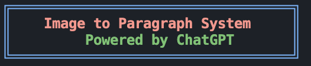
</p>


**Demo**

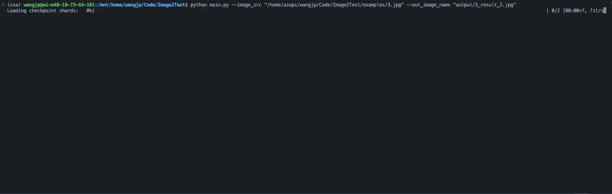


# Transform Image Into Unique Paragraph 


, [Project Website(Coming Soon)]()


**(Can run on 8GB memory GPU)**
<p align="center">
  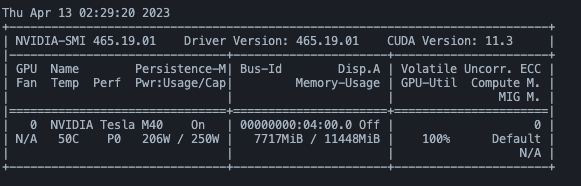
</p>


**Main Pipeline**

<p align="center">
  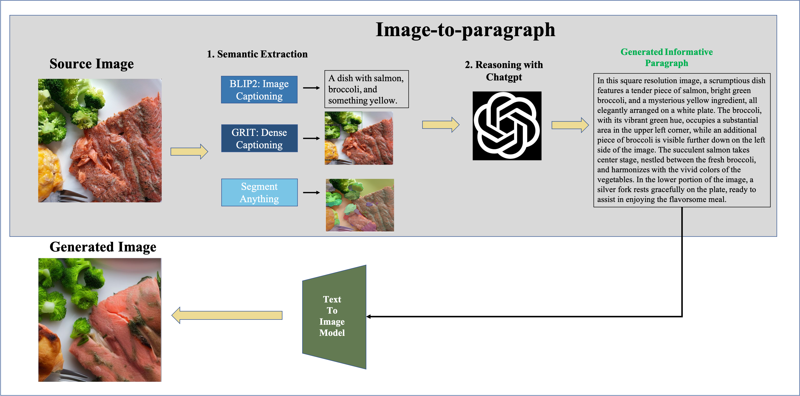
</p>


**Reasoning Details**

<p align="center">
  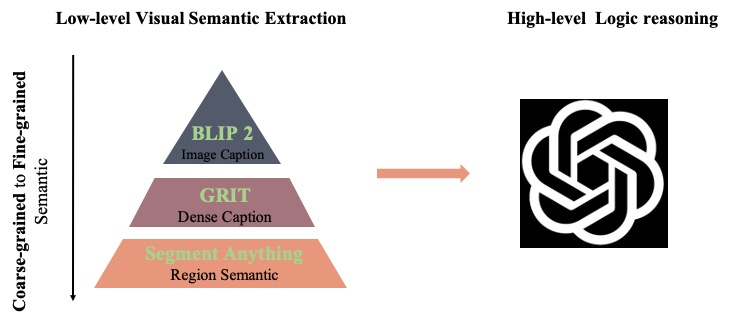
</p>


<p align="left">
    <strong><span style="font-size: 24px;">News</span></strong>
</p>


- 14/April/2023. Our project is very popular in twitter. Looking [the posted twitter](https://twitter.com/awinyimgprocess/status/1646225454599372800?s=46&t=HvOe9T2n35iFuCHP5aIHpQ) for details.

### To Do List

#### Done
- [x] GRIT example.
- [x] ControNet, BLIP2.
- [x] Semantic Segment Anything.
- [x] Segment Anything for fine-grained semantic.
- [x] Gradio.
- [x] Integrate GRIT into our code.
- [x] Support GPT4 API.
- [x] Notebook/Huggingface Space.

#### Doing
- [ ] Replace ChatGPT with own trained LLM.
- [ ] Other grounding text2image model as instead of Canny ControlNet.
- [ ] Show retrieval result in gradio.

## Visualization

The text to image model is conrolnet with canny from diffuser.

<p align="center">
  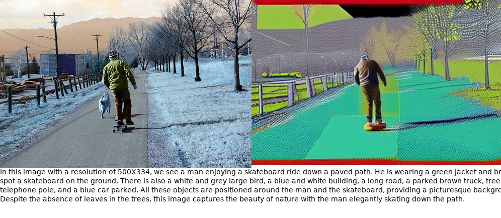
</p>
<p align="center">
  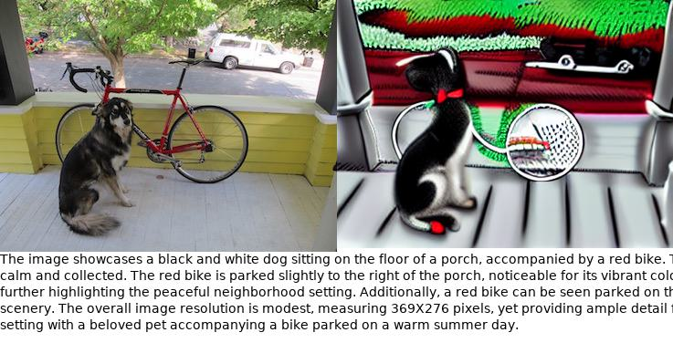
</p>
<p align="center">
  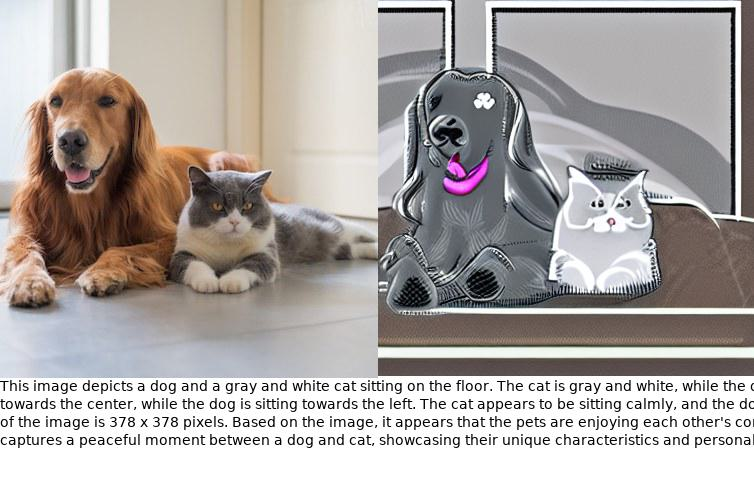
</p>


##  Installation

Please find installation instructions in [install.md](install.md).


## 2. Start

### Simple visualization

```bash
export OPENAI_KEY=[YOUR KEY HERE]
python main.py  --image_src [image_path] --out_image_name [out_file_name]
```

If your GPU memory smaller than 8 GPB.
```bash
python main.py --image_caption_device cpu --semantic_segment_device cpu
```

If you have no GPU available.
```bash
python main.py --image_caption_device cpu --semantic_segment_device cpu --dense_caption_device cpu  --contolnet_device cpu
```

like
```bash
python main.py --image_src "examples/3.jpg" --out_image_name "output/3_result.jpg"
```

**Note: If you have GPU card with larger memory than 8GB. Comment line22 in models/segment_models/semantic_segment_anything_model.py and line29 in models/blip2_model.py for fast inference.**

The generated text and image are show in "output/".

**Note: Use GPT4 for good result as GPT3.5 miss the position information sometime.**


**Note: If you find GRIT model not works, comment stdout=subprocess.DEVNULL, stderr=subprocess.DEVNULL in line 26 of grid_models.py to see error message.**

## Use gradio directly

```bash
python main_gradio.py
```

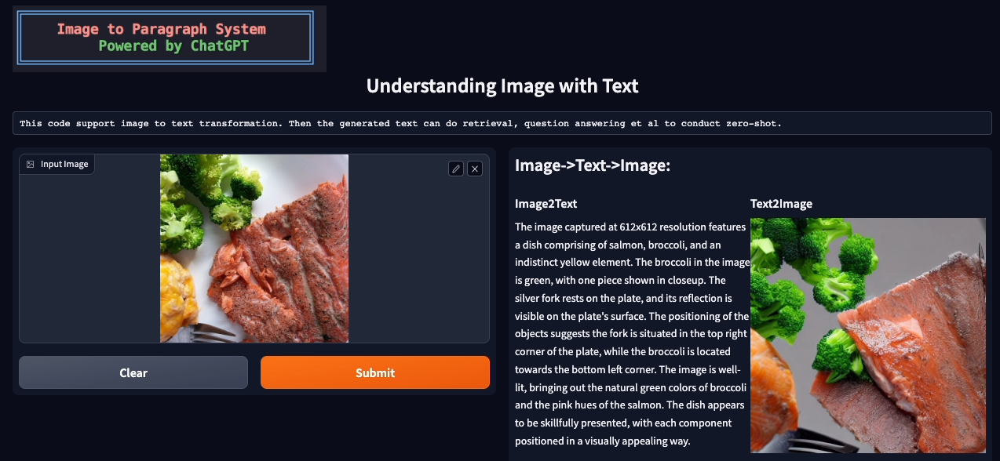

If you have GPU Memory larger than 20GB.
Use device='cuda' as default.


## 3. Visualization

<!-- % a dog sitting on a porch with a bike -->

<table>
  <tr>
    <td>
      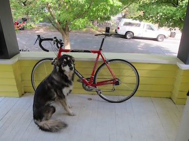
    </td>
    <td>
      A dog sitting on a porch with a bike.
    </td>
    <td>
      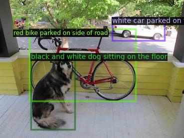
    </td>
    <td>
      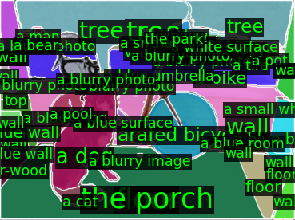
    </td>
  </tr>
  <tr>
    <td align="center">Input</td>
    <td align="center">BLIP2 Image Caption </td>
    <td align="center">GRIT Dense Caption </td>
    <td align="center">Semantic Segment Anything </td>
  </tr>
</table>

The final generated paragraph with ChatGPT is:

>       This image depicts a black and white dog sitting on a porch beside a red bike. The dense caption mentions other objects in the scene, such as a white car parked on the street and a red bike parked on the side of the road. The region semantic provides more specific information, including the porch, floor, wall, and trees. The dog can be seen sitting on the floor beside the bike, and there is also a parked bicycle and tree in the background. The wall is visible on one side of the image, while the street and trees can be seen in the other direction. 

## 4. Retrieval Result on COCO

| Method  | Trainable Parameter | Running Time  |  IR@1   | TR@1|
|---|---|---|---|---|
| Image-text  | 230M | 9H |  43.8 |  33.2 |
|Generated Paragraph-text| 0 |5m|__49.7__|__36.1__|


Interesting, we find compress image into paragraph. The retrieval result is even better than use source image.


## Others
If you have more suggestions or functions need to be implemented in this codebase, feel free to drop me an email awinyimg dot gmail dot com or open an issue.

## Acknowledgment

This work is based on [ChatGPT](http://chat.openai.com), [BLIP2](https://huggingface.co/spaces/Salesforce/BLIP2), [GRIT](https://github.com/JialianW/GRiT),  [OFA](https://github.com/OFA-Sys/OFA),[Segment-Anything](https://segment-anything.com), [Semantic-Segment-Anything](https://github.com/fudan-zvg/Semantic-Segment-Anything), [ControlNet](https://github.com/lllyasviel/ControlNet).