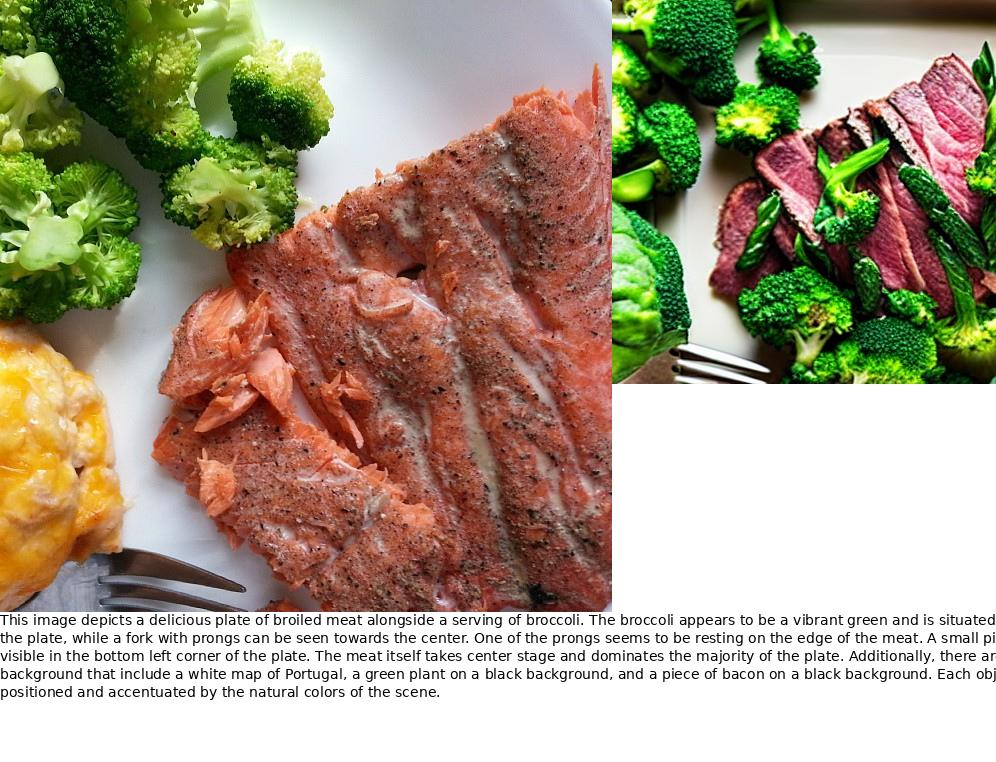

<p align="center">
  
</p>

# Transform Image Into Unique Paragraph


## 1. Installment

### BLIP2, ChatGPT,
```bash
pip install transformers
pip install openai
```

### ControlNet from diffuser

Follow instruction in [diffuser](https://github.com/huggingface/diffusers).

### GRIT

Follow instruction in [GRIT](https://github.com/JialianW/GRiT/blob/master/docs/INSTALL.md).

I suggest to create a new env for GRIT since it depends on Detectron2.

Then
```
cp utils/image_dense_captions.py [YOUR_GRIT_DIRECTORY]
```

modify line10-line12 in __/models/grit_model.py__ accordingly.

### Segment Anything
Follow instruction in [diffuser](https://github.com/huggingface/diffusers).


## 2. News
### Done
- GRIT example.
- ControNet, BLIP2.

### Doing
- Use Segment Anything.
- Replace ChatGPT with own LLM.
- Show retrieval result.
- Gradio

### 3. Retrieval Result on COCO

| Method  | Trainable Parameter | Running Time  |  IR@1   | TR@1|
|---|---|---|---|---|
| Image-text  | 230M | 9H |  43.8 |  33.2 |
|Generated Paragraph-text| 0 |5m|__49.7__|__36.1__|


Interesting, we find compress image into paragraph. The retrieval result is even better than use source image.

### 4. Start

### Simple visualization

```bash
export OPENAI_KEY=[YOUR KEY HERE]
python main.py --image_src --image_src ["abs_path]
```

The generated text and image are show in "output/", as below:


**Note: Use GPT4 for good result as GPT3.5 miss the position information sometime.**

## Use gradio directly

```bash
python main_gradio.py
```


## Acknowledgment

This work is based on [ChatGPT](http://chat.openai.com), [BLIP2](https://huggingface.co/spaces/Salesforce/BLIP2), [GRIT](https://github.com/JialianW/GRiT),  [OFA](https://github.com/OFA-Sys/OFA),[Segment-Anything](https://segment-anything.com), [ControlNet](https://github.com/lllyasviel/ControlNet).