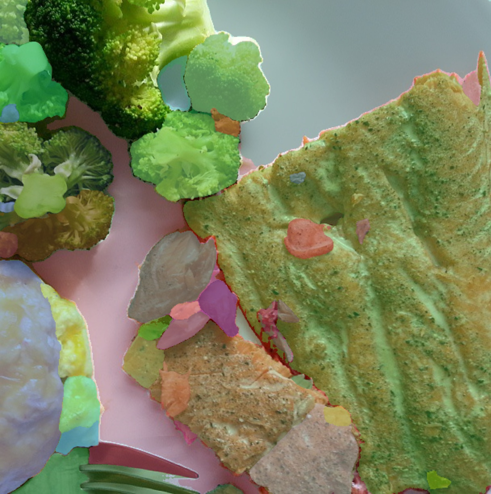
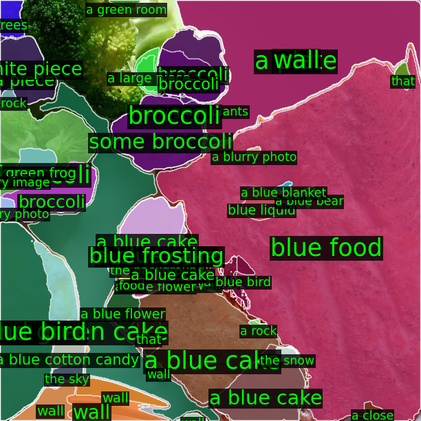

<p align="center">
  
</p>


# Transform Image Into Unique Paragraph 


[](https://twitter.com/awinyimgprocess/status/1646225454599372800?s=46&t=HvOe9T2n35iFuCHP5aIHpQ), [Project Website(Coming Soon)]()


**(Can run on 8GB memory GPU)**
<p align="center">
  
</p>

**Main Pipeline**

<p align="center">
  
</p>


**Reasoning Details**

<p align="center">
  
</p>


## Visualization
<p align="center">
  
</p>
<p align="center">
  
</p>
<p align="center">
  
</p>


##  Installation

Please find installation instructions in [install.md](install.md).

## 1. News
### Done
- GRIT example.
- ControNet, BLIP2.
- Support Segment Anything for fine-grained semantic.

### Doing
- Replace ChatGPT with own trained LLM.
- Show retrieval result in gradio.

## 2. Start

### Simple visualization

```bash
export OPENAI_KEY=[YOUR KEY HERE]
python main.py  --image_src [abs_path] --out_image_name [out_file_name]
```

like
```bash
python main.py --image_src "/Code/Image2Paragraph/examples/3.jpg" --out_image_name "output/3_result.jpg"
```


The generated text and image are show in "output/".

**Note: Use GPT4 for good result as GPT3.5 miss the position information sometime.**

## Use gradio directly

```bash
python main_gradio.py
```


If you have GPU Memory larger than 20GB.
Use device='cuda' as default.


## 3. Segment Visualization


<center>
<table>
  <tr>
    <td>
      
    </td>
    <td>
      
    </td>
  </tr>
  <tr>
    <td align="center">Segment Anything Mask</td>
    <td align="center">Semantic Segment Anything </td>
  </tr>
</table>


## 4. Retrieval Result on COCO

| Method  | Trainable Parameter | Running Time  |  IR@1   | TR@1|
|---|---|---|---|---|
| Image-text  | 230M | 9H |  43.8 |  33.2 |
|Generated Paragraph-text| 0 |5m|__49.7__|__36.1__|


Interesting, we find compress image into paragraph. The retrieval result is even better than use source image.

## Acknowledgment

This work is based on [ChatGPT](http://chat.openai.com), [BLIP2](https://huggingface.co/spaces/Salesforce/BLIP2), [GRIT](https://github.com/JialianW/GRiT),  [OFA](https://github.com/OFA-Sys/OFA),[Segment-Anything](https://segment-anything.com), [Semantic-Segment-Anything](https://github.com/fudan-zvg/Semantic-Segment-Anything), [ControlNet](https://github.com/lllyasviel/ControlNet).